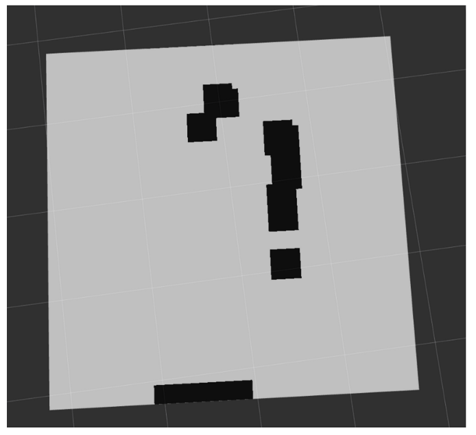
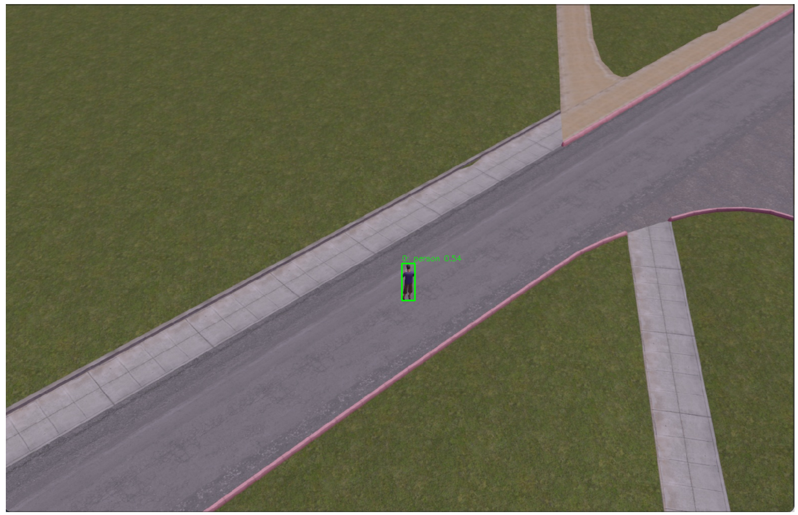
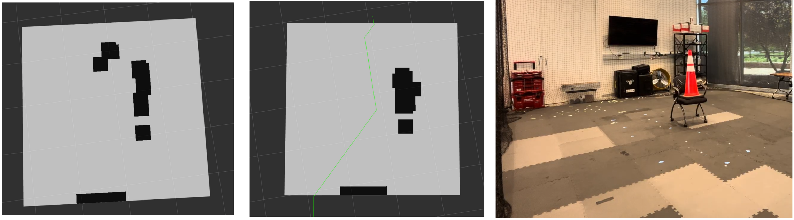

# StereoSight ROS 2 Package

This repository provides a complete pipeline for real‑time stereo‑vision‑based local planning and object following on drones using ROS 2 and ModalAI VOXL 2.

---

## Package Overview

1. **Perception & Mapping** (`map_publisher_without_visualization.py`)
2. **Object Tracking & Following (Simulation)** (`object_follower.py`)
3. **Object Tracking & Following (Real Drone, TFLite)** (`follower_pub.py`)
4. **Local Planner (Diagnostics)** (`planner_diag.py`)
5. **Local Planner (Subscriber Mode)** (`planner_sub.py`)

---

## 1. Perception & Mapping Node

**Script:** `map_publisher_without_visualization.py`   
**Purpose:** Converts a calibrated stereo point cloud into a 2D occupancy grid in the drone’s local frame.

### High‑Level Workflow
1. **Subscribe** to `/stereo_front_pc` (`sensor_msgs/PointCloud2`), `/fmu/out/vehicle_local_position`, and `/fmu/out/vehicle_attitude`.
2. **Transform** raw camera points into the NED frame via a fixed rotation matrix.
3. **Filter & Cluster**:
   - Down‑sample large clouds (> 50k points).
   - Remove points within an origin radius (drone body exclusion).
   - Cluster with DBSCAN and filter by cluster size to suppress noise.
4. **Histogram → Binary Grid**:
   - Compute a 2D histogram over X/Y bins.
   - Apply median filtering, threshold to binary occupancy.
   - Dilate obstacles by a padding parameter.
5. **Publish** `nav_msgs/OccupancyGrid` on `occupancy_grid`, with moving grid origin and yaw alignment based on current drone pose.

### Usage
```bash
ros2 run px4_ros_com map_publisher_without_visualization
```
Adjust grid size, padding, and clustering thresholds via ROS 2 parameters or code constants.


---

## 2. Object Tracking & Following (Simulation)

**Script:** `object_follower.py`   
**Purpose:** Simulation-only node that detects and tracks a chosen object in the camera view using YOLO v8, then publishes offboard setpoints to follow it in simulation.

### High‑Level Workflow
1. **Subscribe** to:
   - `/image_rect/compressed` (`sensor_msgs/CompressedImage`)
   - `/fmu/out/vehicle_local_position`
   - `/fmu/out/vehicle_status`
   - `/fmu/out/vehicle_control_mode`
2. **Decode & Inference**:
   - Use Ultralytics YOLO v8n to detect bounding boxes in each frame.
   - Display detections in an OpenCV window.
3. **Target Selection**:
   - Press number keys (0–9) to lock onto a detected object.
4. **Compute Setpoints**:
   - Normalize pixel error from image center.
   - Calculate desired North/East/Down offsets and yaw adjustments based on model output.
5. **Publish**:
   - `px4_msgs/OffboardControlMode` heartbeat at 20 Hz.
   - `px4_msgs/TrajectorySetpoint` whenever offboard is active.
   - Annotated image on `/image_rect/yolo_annotated`.

### Usage
```bash
ros2 run px4_ros_com object_follower.py
```
Adjust parameters (`follow_distance`, `hover_height`, `yaw_gain`) via ROS 2 parameters or in‑script defaults.


---

## 3. Object Tracking & Following (Real Drone)

**Script:** `follower_pub.py`   
**Purpose:** On-vehicle node that uses the VOXL 2’s built-in YOLO v11n model (via TFLite) to detect a specified class and publish trajectory goals to `/planner/goal` for real-world flight.

### High‑Level Workflow
1. **Launch** and **enter target class** when prompted (e.g., `laptop`).
2. **Subscribe** to:
   - `/tflite_data` (`voxl_msgs/msg/Aidetection`)
   - `/fmu/out/vehicle_local_position` (`VehicleLocalPosition`)
   - `/fmu/out/vehicle_status` (`VehicleStatus`)
   - `/fmu/out/vehicle_control_mode` (`VehicleControlMode`)
3. **Detection Callback**:
   - Receives bounding boxes and class names from TFLite inference messages.
   - Filters for the user-specified class.
   - Computes bounding box center (cx, cy) and area.
   - Initializes `desired_area` on first detection to maintain target distance.
4. **Compute Setpoints**:
   - Normalize pixel errors: `ex = (cx - img_w/2)/img_w`, `ey = (cy - img_h/2)/img_h`.
   - Calculate North/East/Down setpoints using gains `K_FWD`, `K_LAT`, `K_VERT` and area error.
   - Determine yaw adjustment via `K_YAW * ex`.
   - Round positions to one decimal.
5. **Heartbeat & Publishing**:
   - Timer (20 Hz) publishes `OffboardControlMode` heartbeat.
   - When offboard enabled, publishes `TrajectorySetpoint` to `/planner/goal`.
   - Logs current goal coordinates for monitoring.

### Usage
```bash
ros2 run px4_ros_com follower_pub.py
```
Follow the prompt to enter your desired object class, arm the drone, and switch to OFFBOARD mode.  
Remap `/planner/goal` to any planner node for integrated local planning.


---

## 4. Local Planner (Diagnostics)

**Script:** `planner_diag.py`   
**Purpose:** Standalone Dijkstra planner that asks for a fixed goal at startup, then listens to `occupancy_grid` and publishes a safe path.

### High‑Level Workflow
1. **Goal Setup:** Prompt user for `(x, y)` goal in world coordinates on launch.
2. **Subscribe** to:
   - `/fmu/out/vehicle_local_position`
   - `/fmu/out/vehicle_control_mode`
   - `occupancy_grid`
3. **Compute Cost Grid:** Convert occupancy values >50 to infinite cost, others to unit cost.
4. **Run Dijkstra** on the grid from current drone cell to goal cell.
5. **Publish**:
   - `nav_msgs/Path` (`planned_path`) for visualization.
   - Stepwise `TrajectorySetpoint` at 10 Hz, with automatic replanning if the next waypoint becomes blocked.

### Usage
```bash
ros2 run px4_ros_com planner_diag.py
```
Enter goal when prompted, then arm drone and switch to OFFBOARD to start autonomous navigation.

### Visualization
- Use `rviz2` to visualize the planned path and occupancy grid.


---

## 5. Local Planner (Subscriber Mode)

**Script:** `planner_sub.py`   
**Purpose:** Decoupled planner that subscribes to dynamic goals from a follower node on `/planner/goal`.

### High‑Level Workflow
1. **Subscribe** to:
   - `/fmu/out/vehicle_local_position`
   - `/fmu/out/vehicle_control_mode`
   - `occupancy_grid`
   - `/planner/goal` (`px4_msgs/TrajectorySetpoint`)
2. **Update Goal:** On each new setpoint from `/planner/goal`, recompute goal cell and replan path.
3. **Publish**:
   - `nav_msgs/Path` for visualization.
   - `TrajectorySetpoint` toward each waypoint, maintaining the follower’s yaw.

### Usage
```bash
ros2 run px4_ros_com planner_sub.py
```
Pair this with `object_follower.py`by remapping their setpoint publisher to `/planner/goal`.


---

## Visualization & Debugging
- Launch `rviz2` and add:
  - **OccupancyGrid**: `/occupancy_grid`
  - **Path**: `/planned_path`
  - **TF**: Show the `map` and `fmu` frames.

## Notes & Tuning
- Ensure your stereo camera calibration is accurate.
- Tune clustering (`DBSCAN_EPS`, `MIN_POINTS_PER_CLUSTER`) and grid parameters (`GRID_BINS`, `padding`) to match your environment.
- Adjust YOLO detection confidence threshold or TFLite parameters if needed.

---
## Demo Video
Demonstration of the complete pipeline in action can be found [here](https://drive.google.com/drive/folders/1kjNyi5jBFPzSZh6DpPPCA_q1pGDGELaL?usp=drive_link).

## Contributions
[Nitish](https://rrnitish.com/), [Eashwar Sathyamurthy](https://github.com/Eashwar-S)

## License
This project is licensed under the MIT License. See [LICENSE](LICENSE) for details.
